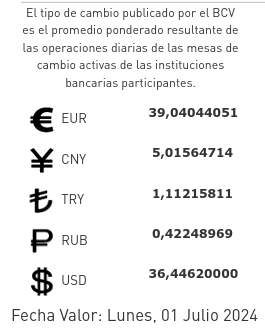

# bcv-api
bcv-api is a small (fast ?) python library that connects to
[BCV](https://www.bcv.org.ve) to parse html and get the current price of
currencies in VEF. 


# Requeriments
- python3 >= 3.9
- urllib and typing (standard libraries)

# Using bcv-api


```python3
# importing BCV and creating object.
from bcv_api import BCV
bcv_con = BCV()

# Get a currency
eur = bcv_con.currencies[0]
print(eur, bcv_con.get_currency(eur))

# Get all currencies
for currency, price in bcv_con.get_currencies().items():
    print(currency, price)

# Use last html saved by get_currencies() to not use internet in this query.
cny = bcv_con.currencies[1]
print(cny, bcv_con.get_currency(cny))
```

# Installation
You can install BCV-api from [Pypi](https://pypi.org/project/bcv-api/)
```sh
pip install bcv-api
```

## Made by [Sivefunc](https://gitlab.com/sivefunc)
## Licensed under [GPLv3](LICENSE)
